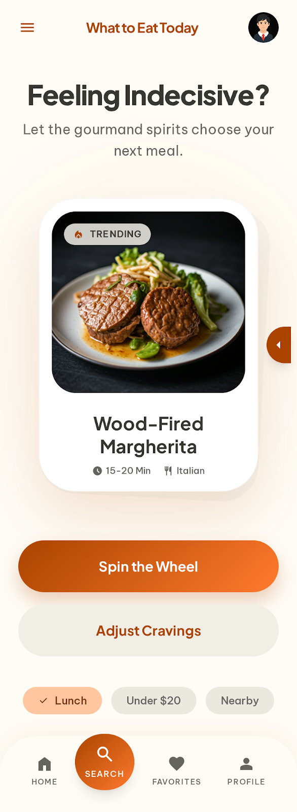
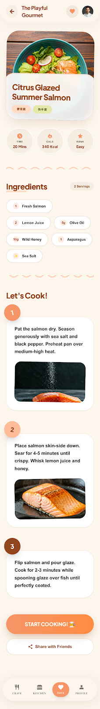
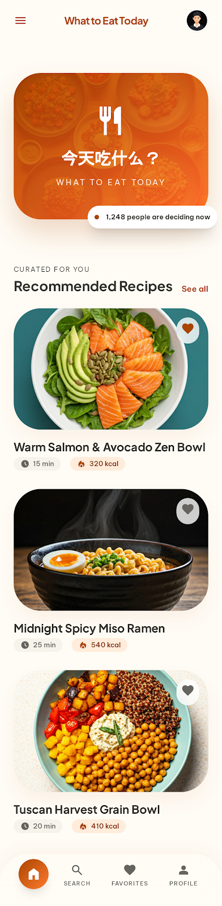
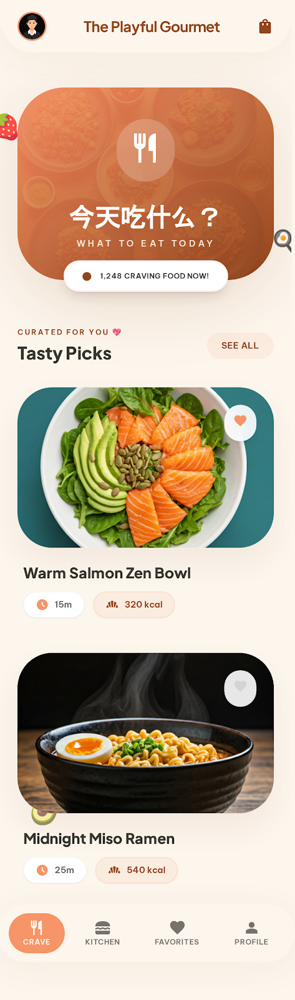
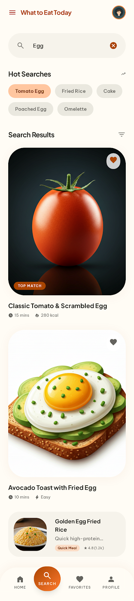

# What to Eat Today

## 项目简介

**What to Eat Today** 是一款基于微信小程序开发的食谱推荐应用，旨在帮助用户解决日常饮食选择困难的问题。通过提供精美的食谱展示、随机推荐功能和个性化收藏系统，为用户提供便捷的饮食灵感和烹饪指导。

## 功能特性

### 核心功能

- **食谱浏览**：展示精选食谱列表，包含详细的食谱信息和图片
- **随机推荐**：通过轮盘随机生成食谱，解决用户选择困难
- **食谱详情**：提供详细的食材清单、烹饪步骤和营养信息
- **收藏系统**：支持用户收藏喜欢的食谱，方便后续查看
- **个人中心**：展示用户信息和使用统计数据

### 技术特点

- 采用微信小程序原生开发，无需安装，即点即用
- 响应式设计，适配不同屏幕尺寸
- 流畅的动画效果，提升用户体验
- 本地数据存储，确保数据持久化
- 支持分享功能，方便用户分享美食发现

## 技术栈

- **前端框架**：微信小程序原生框架
- **开发语言**：JavaScript
- **样式语言**：WXSS
- **页面结构**：WXML
- **数据存储**：微信小程序本地存储

## 项目结构

```
WhatToEatToday/
├── pages/
│   ├── index/           # 首页，展示食谱列表
│   ├── random/          # 随机食谱页面
│   ├── detail/          # 食谱详情页面
│   ├── favorites/       # 收藏页面
│   └── profile/         # 个人中心页面
├── app.js               # 应用全局配置
├── app.json             # 项目配置文件
├── app.wxss             # 全局样式文件
├── project.config.json  # 项目配置
└── sitemap.json         # 小程序索引配置
```

## 核心功能模块

### 1. 首页模块

**功能**：首页jin展示精选食谱列表，支持快速导航到随机推荐页面和食谱详情页面，同时提供收藏功能。

**实现**：

- 展示食谱卡片，包含标题、图片、烹饪时间和热量信息
- 支持点击收藏按钮切换收藏状态
- 点击食谱卡片进入详情页
- 点击"随机"按钮进入随机推荐页面

### 2. 随机推荐模块

**功能**：通过轮盘动画随机生成食谱推荐，解决用户选择困难的问题。

**实现**：

- 实现轮盘旋转动画效果
- 随机从食谱库中选择食谱
- 展示推荐食谱的详细信息
- 提供调整口味偏好的功能入口

### 3. 详情页模块

**功能**：展示食谱的详细信息，包括食材清单、烹饪步骤和营养信息，同时支持收藏和分享功能。

**实现**：

- 展示食谱标题、图片、标签、烹饪时间、热量、难度和份量
- 详细列出食材清单
- 分步展示烹饪步骤，包含图片说明
- 支持收藏/取消收藏功能
- 支持分享到好友和朋友圈

### 4. 收藏模块

**功能**：展示用户收藏的食谱列表，支持快速访问和管理收藏。

**实现**：

- 从全局数据中加载收藏的食谱
- 展示收藏食谱的卡片列表
- 支持点击进入详情页
- 支持取消收藏功能
- 提供快速返回首页的入口

### 5. 个人中心模块

**功能**：展示用户信息和使用统计数据，提供设置和登出功能。

**实现**：

- 展示用户头像、名称和邮箱
- 显示用户的食谱尝试数量、收藏数量和创建数量
- 提供设置项入口
- 支持登出功能

## 页面展示

### 首页



### 随机推荐



### 食谱详情



### 收藏页面



### 个人中心



## 安装与使用

### 开发环境

1. 下载并安装 [微信开发者工具](https://developers.weixin.qq.com/miniprogram/dev/devtools/download.html)
2. 克隆本项目到本地
3. 在微信开发者工具中导入项目
4. 选择小程序项目类型，填写AppID（或使用测试号）
5. 点击"编译"按钮运行项目

### 使用指南

1. **浏览食谱**：在首页浏览精选食谱，点击感兴趣的食谱查看详情。
2. **随机推荐**：点击首页的"随机"按钮或底部导航栏的"Search"图标，进入随机推荐页面，点击轮盘获取随机食谱推荐。
3. **查看详情**：在食谱详情页面，您可以查看详细的食材清单、烹饪步骤和营养信息，还可以收藏喜欢的食谱。
4. **管理收藏**：点击底部导航栏的"Favorites"图标，查看和管理您收藏的食谱。
5. **个人中心**：点击底部导航栏的"Profile"图标，查看个人信息和使用统计，管理应用设置。

## 未来规划

- 增加用户注册登录功能，实现云端数据同步
- 支持用户上传和分享自己的食谱
- 添加食材分类和筛选功能
- 实现智能推荐算法，根据用户偏好推荐食谱
- 增加烹饪视频教程
- 支持购物清单功能，自动生成食材采购清单

## 许可证

本项目采用 MIT 许可证，详情请查看 [LICENSE](LICENSE) 文件。

## 贡献

欢迎提交 Issue 和 Pull Request 来帮助改进这个项目！

## 联系方式

如有问题或建议，欢迎联系我们。
